# Sistemas Operacionales - Parcial 1  

**Nombre:** Jefry Cardona Chilito  
**Código:** A00320232  
**Correo:** jefry.cardona@correo.icesi.edu.co  
**Profesor:** Daniel Barragan  
**Url repositorio:** https://github.com/Jefry9508/so-exam1-1  

## Descarga y comprobación de imagen Debian 9

La imagen del sistema operativo Debian 9 se descargó de la pagina oficial, cuyo link se presenta a continuación. (https://www.debian.org/distrib/netinst).

La página da distintos tipos de imagenes para diferentes arquitecturas. En el caso nuestro, escogeremos la amd64.

Cuando la descarga terminó, se prosiguió a realizar una validación de la imagen. Para esto se buscó los checksums que pone a disposición el repositorio de Debian siguiendo el enlace que se presenta a continuación. (https://cdimage.debian.org/debian-cd/current/amd64/iso-cd/).

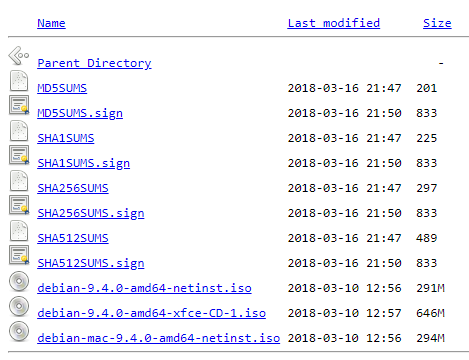

Para nuestro caso, usaremos la primera opción que es el checksum MD5SUMS que al seleccionarnos nos redirige a la pagina que tiene los valores para las tres imagenes que ofrece para descargar Debian 9.

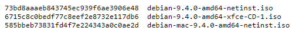

Se usó el primer valor que aparece en la imagen de arriba, ya que es correspondiente al iso que se descargó.

Para realizar la comprobación de la imagen, se utilizó la herramienta [MD5_and_SHA_Checksum_Utility](http://descargar.cnet.com/MD5-SHA-Checksum-Utility/3000-2092_4-10911445.html) que nos permite realizar el checksum de un archivo y compararlo con el que el usuario le pase por parámetro.

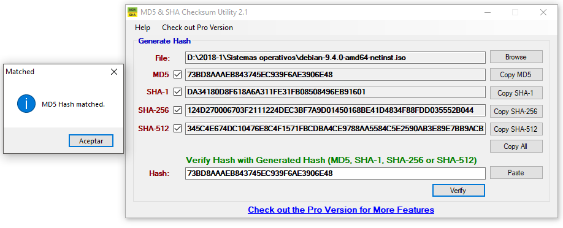


## Instalación del sistema operativo Debian 9 versión servidor

1. Al iniciar Oracle VM VirtualBox, en la parte superior izquierda presionamos en el botón que dice Nueva. Esto abrirá una nueva ventana.

2. En esta nueva ventana colocaremos el nombre de nuestra máquina virtual, el tipo de sistema operativo y su versión. Presionamos next.

3. Elegimos la cantidad de memoria RAM que deseamos para nuestra máquina. Por defecto se configura en 1Gb, así que la dejaremos así y presionamos next.

4. Ahora configuraremos el disco duro virtual de la máquina. Nos brinda 3 opciones: No agregar un disco duro virtual, crear un disco duro virtual o usar un archivo de disco duro virtual existente. Por defecto esta seleccionada la segunda opción, así que usaremos esa y presionamos next.

5. Eligiremos el tipo de archivo de disco duro virtual. Nos presenta 3 opciones: VDI(VirtualBox Disk Image), VHD(Virtual Hard Disk) y VMDK(Virtal Machine Disk). Normalmente se configura con la primera opción así escogeremos esa y presionamos next.

6. Configuramos el tipo de almacenamiento en disco. Nos presenta dos opciones: reservado dinamicamente y tamaño fijo. Usaremos la opción de reservado dinamicamente y presionamos next.

7. Asignaremos capacidad de almacenamiento al disco duro virtual. Por defecto se asigna 8Gb, así que lo dejaremos así y presionamos crear.

8. Ahora vamos de nuevo a la parte superior izquierda y presionamos en Configuración. Se nos abrirá una nueva ventana con todas las opciones de configuración de la máquina virtual antes de arrancarla.

9. Nos dirigimos a la barra de opciones vertical y presionamos en donde dice Almacenamiento.

10. Allí presionamos sobre la imagen de un disco que dice vacío. Esto nos abrirá unas opciones al lado derecho en donde podremos montar la imagen del sistema operativo Debian 9. Presionamos Aceptar e iniciamos la máquina virtual.

11. Cuando la máquina ya ha iniciado, preguntará que tipo de instalación queremos usar. Escogeremos la opción instalación gráfica por mayor facilidad.

12. Escogemos el idioma, español en nuestro caso y presionamos Continue.

13. Seleccionamos nuestra ubicación (Colombia) y presionamos Continuar.

14. Selccionamos la configuración del teclado. Escogeremos el latinoamericano y presionamos continuar.

15. Después de que termine de cargar todos los componentes necesarios para la instalación nos pedirá un nombre para el sistema. Lo podemos escribir o dejarlo por defecto y presionamos continuar.

16. A continuación nos pide el nombre de dominio. Podemos ignorar esta configuración y presionar Continuar.

17. Seguimos con la configuración de la clave de superusuario. La escribimos y presionamos Continuar.

18. Configuramos un nuevo usuario para tareas que no tengan que ver con superusuario.

19. Llegamos al Particionado de discos. En esta opción escogeremos la que está seleccionada por defecto que es Instalación guiada utilizando todo el disco y presionamos Continuar.

20. Aparece una pantalla con el disco en donde se instalará el sistema base. Presionamos Continuar.

21. Escogemos la opción seleccionada por defecto que es instalar todos los ficheros en una sola partición y presionamos Continuar.

21. Luego aparece una pantalla con la configuración que le hemos dado anteriormente. Presionamos Continuar.

22. Aparece una nueva pantalla en donde nos pregunta si queremos aceptar todos los cambios. Seleccionamos Si y presionamos Continuar.

23. El instalador comienza a instalar el sistema base.

24. Cuando termine de instalar el sistema base, nos preguntará si tenemos otro CD o DVD para el gestor de paquetes. Escogemos la opción No y presionamos Continuar.

25. Nos pedirá la ubicación de algú mirror que permita la descarga del gestor de paquetes. Así que escogeremos Colombia como ubicación y como mirror debian.uniminuto.edu y presionamos Continuar.

26. Nos pide una configuración de proxy si la tenemos, de lo contrario, omitimos esta opción.

27. Nos pregunta si queremos enviar datos de uso a los desarrolladores. Escogemos la opción que deseemos y damos en Continuar.

28. A continuación nos permite elegir software adicional para nuestro sistema operativo como como el entorno de escritorio, servidor web, servidor de impresión, SSH server y algunas interfaces de desarrollo. Escogemos las que necesitemos (en mi caso SSH Server, Servidor Web y entorno de escritorio) y presionamos Continuar. (Dependiendo del software adicional que instalemos puede demorarse un poco más de los normal la instalación).

29. Cuando termina de instalar todo el sistema, el instalador sugiere instalar el cargador de arranque GRUB ya que Debian será el unico sistema operativo instalado en el disco duro virtual. Por lo tanto, seleccionamos la opción Si y presionamos en Continuar.

30. Se nos presenta una pantalla con los discos instalados. Así que seleccionamos el disco en el que instalamos Debian y presionamos Continuar.

31. Al terminar la instalación, se despliega una pantalla diciendo que la instalación fue exitosa y que debemos reiniciar la máquina. Presionamos Continuar para reiniciar la máquina virtual.

32. Ahora ya podemos interactuar con el sistema operativo, después de haberse identificado con el usuario que se creó anteriormente.


## Información del sistema operativo

Para obtener información del sistema operativo se utilizaron 4 comandos.

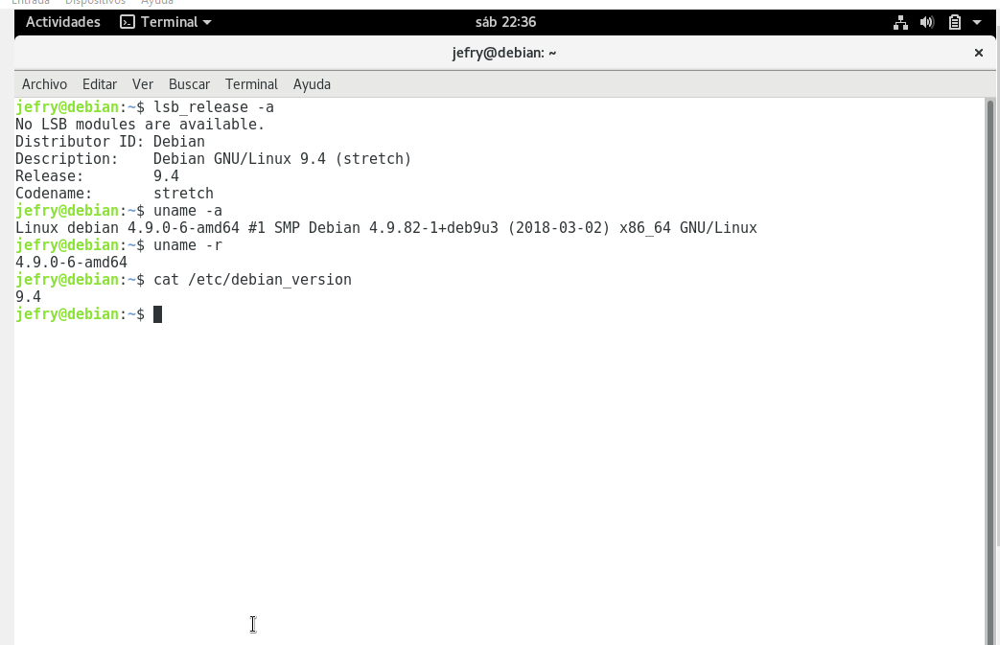

```console
jefry@debian:~$ lsb_release -a
```

Este comando nos imprime cierta información de la LSB (Linux Standard Base) y su distribución y con el parámetro -a le indicamos que nos muestre toda la información.

```console
jefry@debian:~$ uname -a
```

Este comando nos imprime información del sistema y del kernel actual y con el parámetro -a le indicamos que nos muestre toda la información.

```console
jefry@debian:~$ uname -r
```

Es el mismo comando mencionado anteriormente solo que con el parámetro -r le pedimos que sólo nos muestre la distribución o versión del kernel del sistema operativo.

```console
jefry@debian:~$ cat /etc/debian_version
```

Este comando nos imprime la versión del sistema operativo instalado.


## Configuración de interfaz tipo puente

1. Para llevar a cabo esta configuración, nos vamos a la configuración de la máquina virtual y en el menú vertical izquierdo seleccionamos la opción Red.

2. Se nos desplegará una pantalla a la derecha, ahí seleccionamos la pestaña que dice Adaptador 2.

3. Por defecto, la opción de adaptador de red no está seleccionada, por lo cual las demás opciones están deshabilitadas. Así que seleccionamos esta casilla para poder configurar nuestra adaptador puente.

4. En la opción Conectado, desplegamos el menú de opciones y escogemos Adaptador puente.

5. Automáticamente después de haber seleccionado Adaptador puente, en la segunda opción que dice Nombre que hace referencia a la tarjeta de red a usar, se selecciona la que tenemos instalada en nuestro equipo. Por lo tanto, verificamos que si sea la vamos a usar y presionamos Aceptar.

La pantalla con la configuración debería quedar más o menos de la siguiente forma:

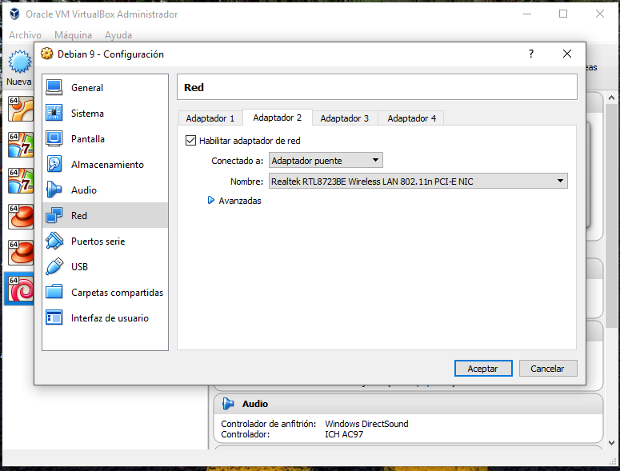


## Acceso a través de Putty

Como el parcial se está resolviendo a través de sistema operativo guest Windows 10, se utilizó la herramienta putty para conectarse remotamente a la máquina virtual a través de SSH.

Para llevar a cabo este procedimiento, primero se debió consultar la ip de nuestra máquina virtual con el comando ```ip a```. Debemos fijarnos en la interfaz de red enp0s8 que fue la que se configuró como adaptador puente y será la que nos permita conectarnos a través de SSH.

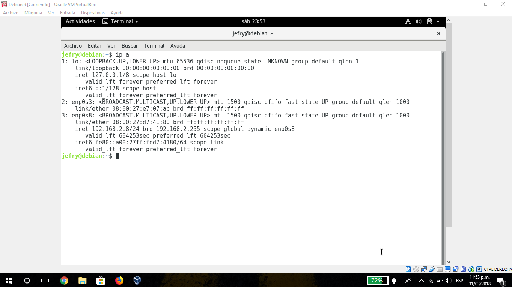

Luego procedemos a iniciar Putty y darle su respectiva configuración. Para esto insertamos la dirección ip de nuestra máquina virtual, selccionamos el puerto 22 que es el que por defecto escucha SSH y en tipo de conexión seleccionamos SSH. La configuración de Putty quedaría de la siguiente manera.

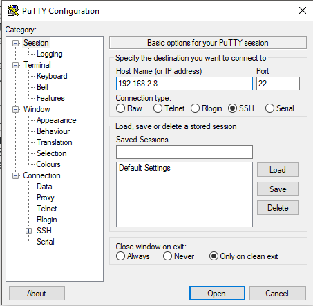

Cuando presionamos Open nos saldrá una alerta por la conexión que se abrirá. Le damos en Si.

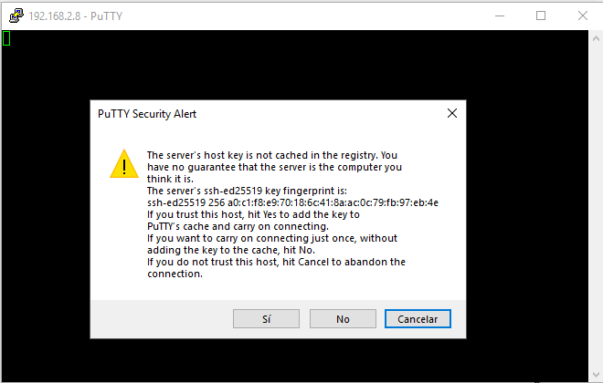

Luego nos aparecerá una nueva ventana pidiendonos que digitemos el usuario con el que queremos identificarnos y su respectiva constraseña. Digitamos la información que nos solicita y ya estaremos conectados remotamente a la máquina virtual Debian.

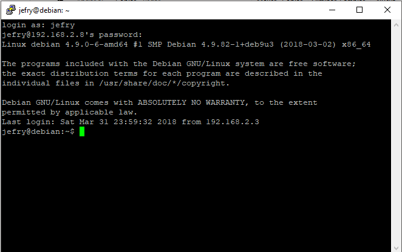

## Instalación git y tig

Para instalar git se usó el siguiente comando:

```console
root@debian:~# apt-get install git -y
```

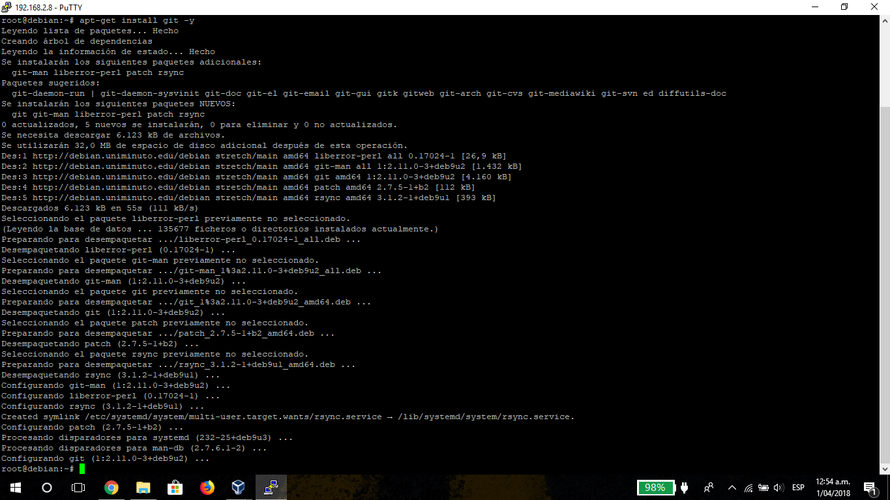

Para instalar tig se usó el siguiente comando

```console
root@debian:~# apt-get install tig -y
```

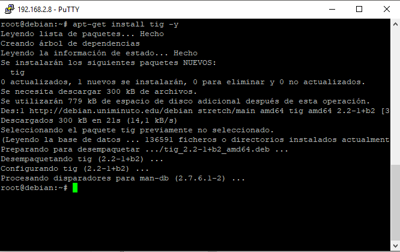

Luego, procedemos a clonar el repositorio utilizando el comando

```console
root@debian:/home/jefry# git clone https://github.com/Jefry9508/so-exam1-1.git
```

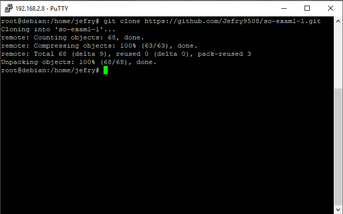

Ya teniendo clonado el repositorio del examen, accedemos a la carpeta que se acaba de crear y utilizamos el comando tig para ver los commit que se han realizado hasta el momento.

```console
root@debian:/home/jefry/so-exam1-1# tig
```

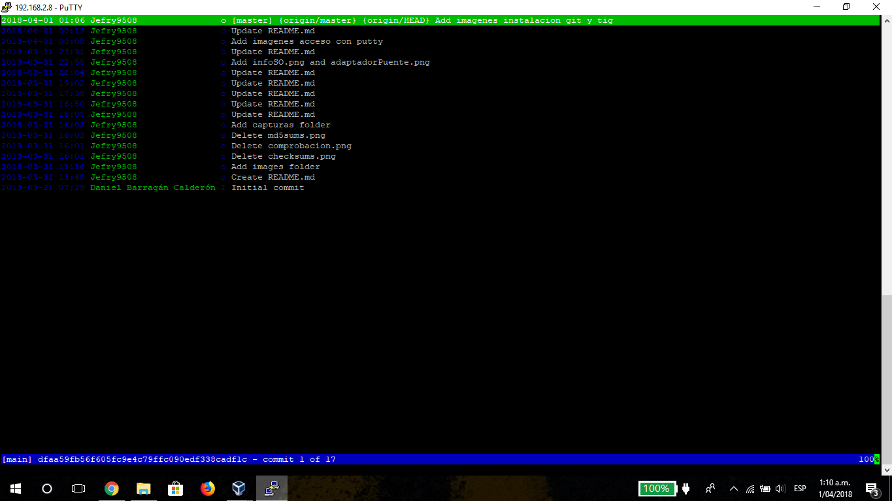


## Exportar la máquina virtual

1. Vamos a la barra de menú superior y presionamos en Archivo y luego en Exportar servicio virtualizado.

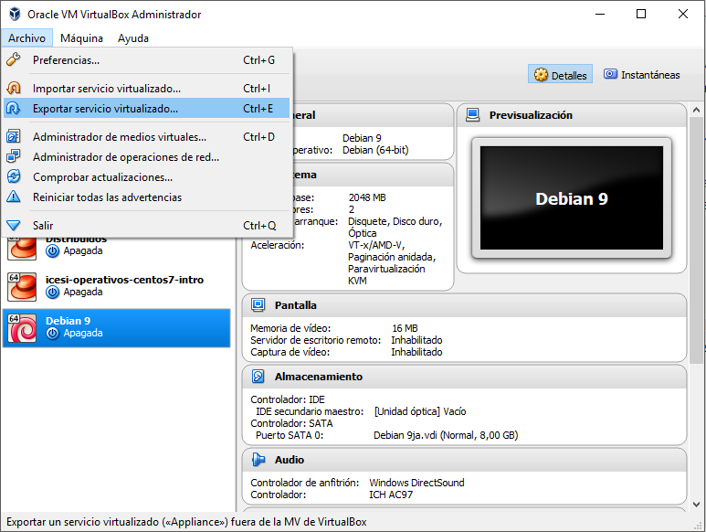

2. Escogemos la máquina virtual a exportar, en nuestr caso Debian 9, y presionamos Next.

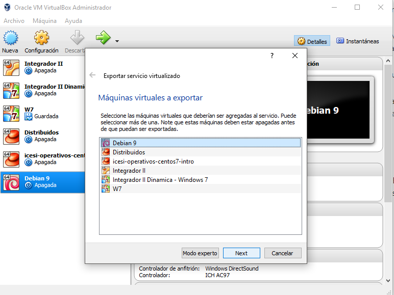

3. Seleccionamos la ubicación en donde queremos exportar la máquina virtual. El formato lo dejamos como está y presionamos en Next.

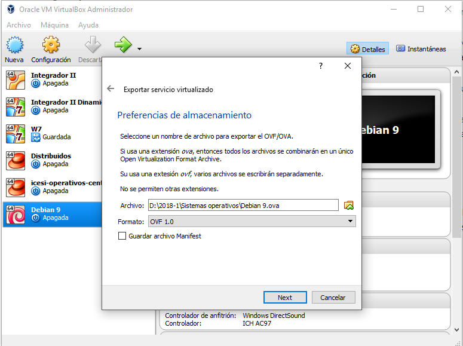

4. Se nos presenta una pantalla con algunos detalles de la máquina virtual. Presionamos en Exportar.

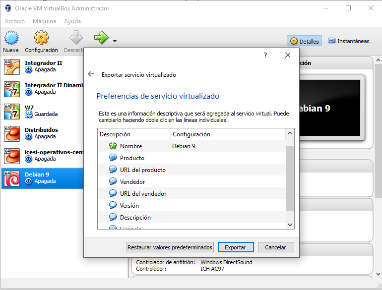

5. VirtualBox comenzará a exportar la máquina virtual.

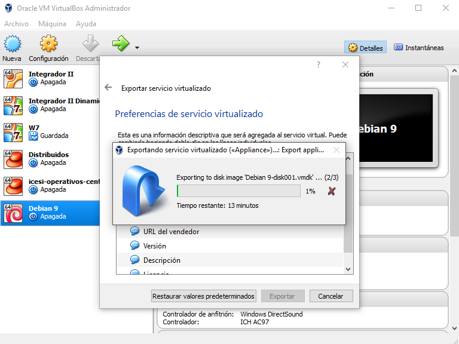


## Importar la máquina virtual


## Comparación entre Debian 9 vs. CentOS 7 
